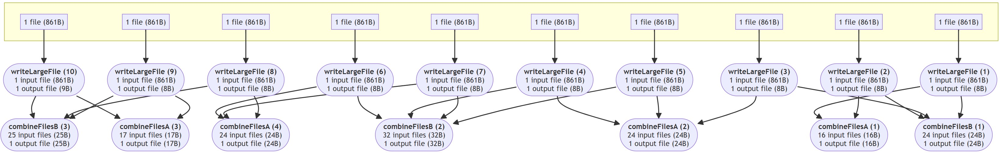

# Nextflow nf-dataflow Plugin – Understand Your Pipeline's Dataflow

This plugin helps you analyze and visualize the data flow within your Nextflow pipeline.

## Features
- **Visual Representation**: Generates a DAG to illustrate the data flow between processes.
- **Detailed Analysis**: Captures inputs and outputs of each process for in-depth examination.
- **Pipeline Overview**: Summarizes data volume processed per process and dependencies.

## Installation
No installation required. Simply add the plugin to your Nextflow config:

```nextflow
plugins {
   id 'nf-dataflow'
}
```

## Usage

### 1. Visualizing the Dataflow
Specify an output file in your Nextflow config:

```nextflow
dataflow {
    dag = "physicalDag.html"
}
```

This generates a `physicalDag.html` file in your working directory.  
Supported formats: All formats Nextflow supports ([docs](https://www.nextflow.io/docs/latest/reports.html#workflow-diagram)).  
**Tested format**: DOT.

Example visualization:  


### 2. Analyzing Process Inputs & Outputs
Create CSV files to track input and output files:

```nextflow
dataflow {
    input = "input.csv"
    output = "output.csv"
}
```

Generated files:
- `input.csv`
- `output.csv`

#### Columns:
| Column    | Description                       |
|-----------|-----------------------------------|
| **name**  | Process instance name             |
| **hash**  | Process hash (matches trace file) |
| **path**  | Input/output file path            |
| **type**  | `f` (file) or `d` (directory)     |

### 3. Analyzing Task Dependencies
Generate a summary file with process dependencies and data volume:

```nextflow
dataflow {
    summary = "summary.csv"
}
```

#### Summary Columns:
| Column         | Description                       |
|----------------|-----------------------------------|
| **task**       | Process instance name             |
| **hash**       | Process hash (matches trace file) |
| **inputs**     | Number of inputs                  |
| **inputSize**  | Total input size                  |
| **outputs**    | Number of outputs                 |
| **outputSize** | Total output size                 |
| **usedBy**     | Number of dependent processes     |

### 4. Additional Options
- **`overwrite`**: If `true`, overwrites existing output files (default: `false`).
